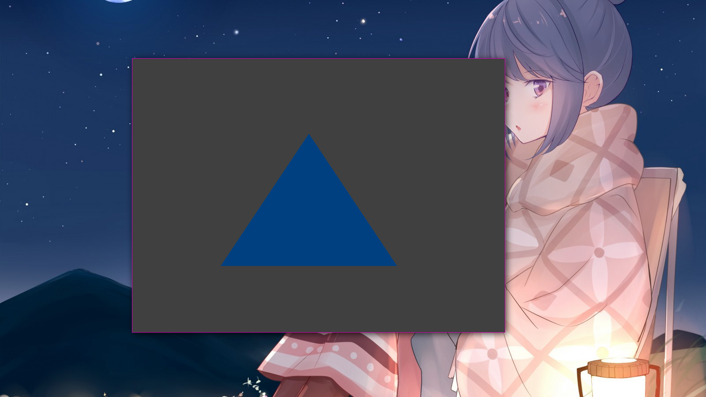

# About

A basic reference for when I forget how to set up a rendering context in C with
GLFW and libepoxy.

# Dependencies

* libepoxy-devel
* glfw-devel
* OpenGL drivers - e.g. mesa, nouveau, etc
* pkg-config
* IEEE / Open Group 1003.1-2017 (POSIX.1-2017) make utility - e.g. PDP make,
GNU Make, BSD Make, etc
* IEEE / Open Group 1003.1-2017 (POSIX.1-2017) c99 utility - e.g. GCC, Clang,
etc
* ISO / IEC 9899:1999 (C99) library - e.g. musl-libc, glibc, etc

# Building

To build, run:

```
make
```

Then, to run the program:

```
./triangle
```

# Screenshot

